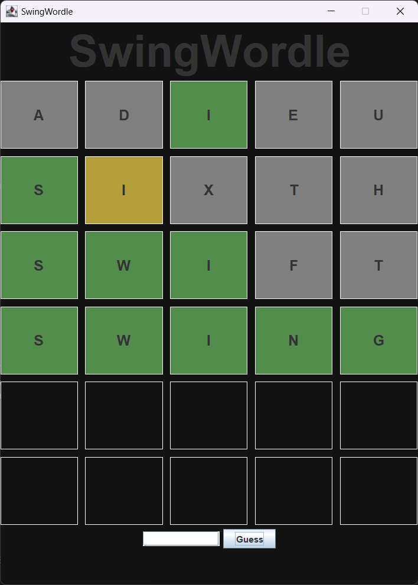

# Swing-Wordle
SwingWordle is an implementation of the popular New York Times game in Java Swing.

## How to Play
Type in a word into the text box, then hit <Enter> or click the "Guess" button to submit your guess.

The below instructions are adapted from NYT official website.

### Guess the Wordle in 6 tries
- Each guess must be a valid 5-letter word.
- The color of the tiles will change to show how close your guess was to the word.

### Examples:
Looking at the image below...
- The first guess contains a green "I". Meaning it is in the word and in the correct spot.
- The second guess contains a yellow "I". Meaning it is in the word, but not in the correct spot.
- The other guessed letters that are highlighted grey denote letters that are **not** in the word.

## Images

## TO-DO
List of things I am planning on implementing down the line:

### Game Logic:
- Score saving
- Error check against list of "valid" words to disallow entering garbage
- Fix error(s) with duplicate letters
- Make executable?

### UI:
- Light and Dark theme (currently only Dark)
- Display keyboard on-screen with correct color coding after guesses

## Contributions
Author/Developer: Braden Pennie
